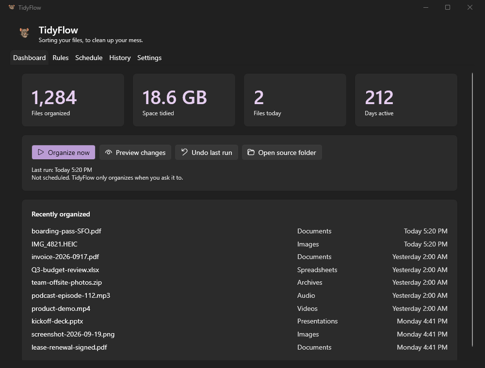
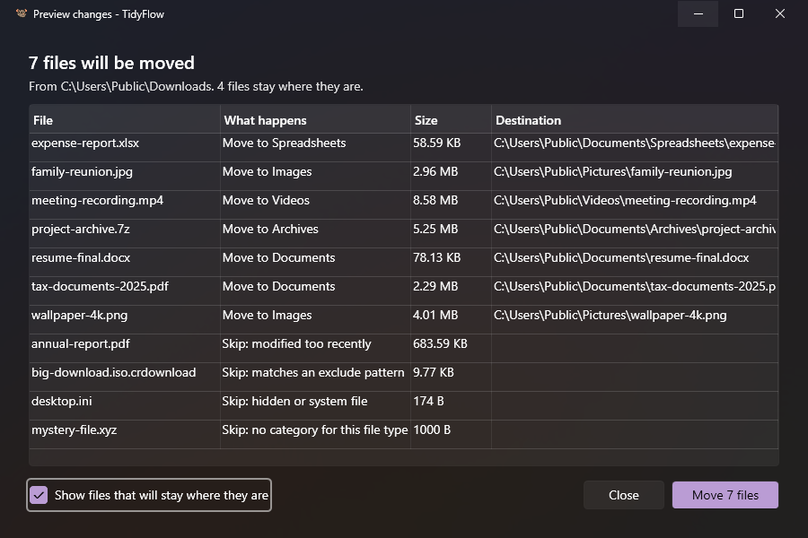
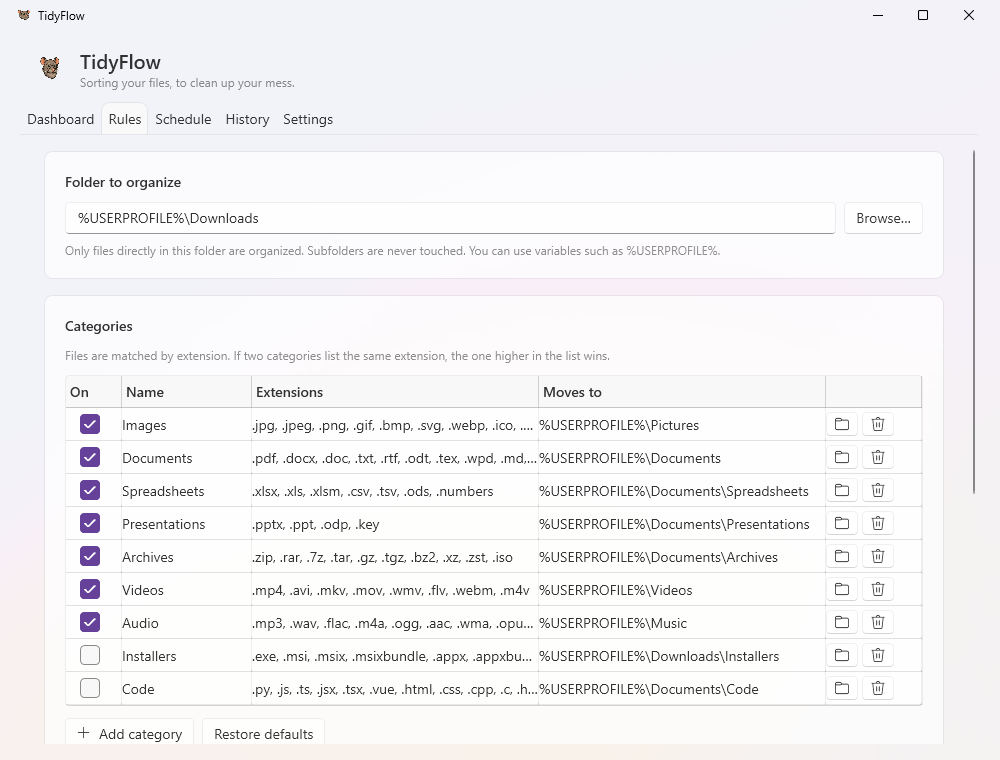

<p align="center">
  
</p>

<p align="center">
  <b>Sorting your files, to clean up your mess.</b>
</p>

<p align="center">
  <a href="https://github.com/ProfessorMoose74/TidyPackRat/releases/latest"></a>
  <a href="https://github.com/ProfessorMoose74/TidyPackRat/actions/workflows/ci.yml"></a>
  <a href="LICENSE"></a>
  
  
</p>

TidyFlow is a free, open-source file organizer for Windows. It moves files out of your Downloads folder (or any folder you choose) into tidy destination folders based on their type. Preview what will happen, organize with one click, on a schedule, or the moment a download finishes, and undo any run if you change your mind.

<p align="center">
  
</p>

## Download

1. Grab the latest zip from **[Releases](https://github.com/ProfessorMoose74/TidyPackRat/releases/latest)**:
   - `TidyFlow-<version>-x64-portable.zip` for most PCs
   - `TidyFlow-<version>-arm64-portable.zip` for Windows on ARM
2. Unzip it somewhere permanent, for example `%LOCALAPPDATA%\Programs\TidyFlow`.
3. Run `TidyFlow.exe`. That's it: it's a single self-contained file with nothing else to install.

Or install it with [WinGet](docs/installation-guide.md#install-with-winget), which also handles updates:

```powershell
winget install ElementalGenius.TidyFlow
```

> **WinGet listing pending:** TidyFlow has been submitted to the WinGet repository. Until Microsoft approves it, `winget install` reports that no package was found; use the download instead.

> **"Windows protected your PC"?** TidyFlow isn't code-signed, so SmartScreen may warn you the first time. Select **More info** → **Run anyway**. Only download TidyFlow from this repository's Releases page.

**Requirements:** Windows 10 version 2004 (build 19041) or later, or Windows 11, on x64 or ARM64.

## Features

| | |
|---|---|
| **Categories** | Sorts by file extension into Images, Documents, Spreadsheets, Videos, Audio and more. Add your own, rename them, or switch them off. |
| **Preview** | See every file and exactly what will happen to it, including why a file stays put, before anything moves. |
| **Undo** | Every run (manual, scheduled or watched folder) is kept in History with an Undo button. Restored files never overwrite anything. |
| **Schedule** | Daily, weekly (your choice of day) or monthly (any day, or the last day), and/or a minute after you sign in. Runs silently in the background, and catches up if your PC was off. |
| **Watch for new files** | Organizes new files about 15 seconds after they finish downloading. |
| **Sensible rules** | Leaves alone files changed in the last N hours, files under N KB, patterns like `*.tmp` or `*.crdownload`, and hidden/system files. Only the folder itself is organized; subfolders are never touched. |
| **Duplicates** | If a name is already taken, add a number (`report_1.pdf`) or leave the file where it is. |
| **Fits into Windows** | Light and dark themes (Windows 11 Fluent style), notification-area icon, toast notifications, start at sign-in. |
| **Private** | Everything stays on your PC. No account, no telemetry, no network access at all. |

<table>
  <tr>
    <td></td>
    <td></td>
  </tr>
  <tr>
    <td align="center"><i>Preview changes before anything moves</i></td>
    <td align="center"><i>Categories and rules (light theme)</i></td>
  </tr>
</table>

## Quick start

1. Open TidyFlow. On the **Rules** tab, check the folder to organize (Downloads by default) and the categories, then select **Save** (Ctrl+S).
2. Select **Preview changes** to see what would happen. When it looks right, select **Move N files**, or use **Organize now** (F5).
3. Changed your mind? Open **History** and select **Undo** on that run.
4. Optional: on the **Schedule** tab, turn on **On a schedule** or **Watch for new files**. Under **Settings**, turn on **Start TidyFlow when I sign in** so watching keeps working after a restart.

More in [QUICKSTART.md](QUICKSTART.md).

## What's new in 2.0

TidyFlow 2.0 (previously *Tidy Pack Rat*) is a ground-up rewrite on .NET 10:

- **One engine for everything.** Organize now, scheduled runs and the file watcher follow exactly the same rules. The old PowerShell worker is gone, and with it the console windows and crashes.
- **Preview and History with Undo**, for every run including scheduled ones.
- **Better scheduling:** pick the day, run at sign-in, see the next run time. Silent background runs that survive moving or updating the app.
- **A modern Fluent interface** that follows your light/dark setting.
- **Single-file portable downloads** for x64 and ARM64.
- **Many 1.x bugs fixed**, from the file-size filter using the wrong units to undo only restoring one file. Your 1.x settings upgrade automatically.

The full list is in the [changelog](CHANGELOG.md).

## Command line

| Command | What it does |
|---|---|
| `TidyFlow.exe --run` | Organizes once with no window, using your saved settings (this is what the scheduled task runs). Exit codes: `0` success, `1` some files failed, `2` settings invalid, unreadable or never saved, `3` run failed. |
| `TidyFlow.exe --minimized` | Starts in the notification area. |
| `TidyFlow.exe --uninstall` | Removes TidyFlow's scheduled task, start-at-sign-in entry and notification registration. |
| `TidyFlow.exe settings.tfconfig` | Offers to import exported settings (you can also drag the file onto `TidyFlow.exe`). |

## Where your data lives

Settings, history, statistics and logs are kept in `%LOCALAPPDATA%\TidyFlow`. **Settings → Open data folder** and **Open log folder** take you there. The [Configuration Guide](docs/configuration-guide.md) documents every setting and the `config.json` format.

## Updating and uninstalling

- **Update:** exit TidyFlow (right-click the notification-area icon → **Exit**), replace `TidyFlow.exe` with the new one, and start it again. With WinGet: exit TidyFlow, then `winget upgrade ElementalGenius.TidyFlow`. Your settings carry over.
- **Uninstall:** exit TidyFlow, run `TidyFlow.exe --uninstall`, then delete its folder (with WinGet: `tidyflow --uninstall`, then `winget uninstall ElementalGenius.TidyFlow`). Delete `%LOCALAPPDATA%\TidyFlow` too if you don't want to keep your settings and history. Files TidyFlow already organized stay where they are.

## Documentation

| Guide | For |
|---|---|
| [Quick Start](QUICKSTART.md) | Getting set up in a few minutes |
| [Installation Guide](docs/installation-guide.md) | Installing, upgrading from 1.x, uninstalling |
| [Configuration Guide](docs/configuration-guide.md) | Every setting, rule and file TidyFlow uses |
| [Troubleshooting](docs/troubleshooting.md) | Files not moving, schedules, the watcher, SmartScreen |
| [Changelog](CHANGELOG.md) | What changed in each version |
| [Optional MSIX package](docs/msix-packaging.md) | Building an installable package yourself |

## Building from source

You need the [.NET 10 SDK](https://dot.net).

```powershell
git clone https://github.com/ProfessorMoose74/TidyPackRat.git
cd TidyPackRat

.\build.ps1                       # build and run all tests
dotnet run --project src/TidyFlow # run the app
.\build.ps1 -Portable             # single-file TidyFlow.exe + release zip in dist\
```

Tip: set `TIDYFLOW_DATA_DIR` to a scratch folder while developing, so testing never touches your real settings.

| Path | Contents |
|---|---|
| `src/TidyFlow.Core` | The organizing engine, settings and history storage, logging. No UI; fully unit-tested. |
| `src/TidyFlow` | The WPF app (MVVM): views, view models, scheduler, watcher, notifications, tray icon. |
| `src/TidyFlow.Package` | Optional MSIX packaging project. |
| `tests/` | xUnit tests for the engine and the app services. |
| `tools/` | Scripts that rebuild the icon and package images from `assets/logo.png`. |

Pushing a `vX.Y.Z` tag builds, tests and publishes a GitHub release with both downloads. See [CONTRIBUTING.md](CONTRIBUTING.md) for details.

## Contributing

Bug reports, ideas and pull requests are all welcome! Please read [CONTRIBUTING.md](CONTRIBUTING.md) and our [Code of Conduct](CODE_OF_CONDUCT.md). Found a security problem? Please report it privately as described in [SECURITY.md](SECURITY.md).

Ideas on the roadmap: a first-run setup wizard, multiple source folders, and rules beyond file extensions. Suggestions are welcome in [issues](https://github.com/ProfessorMoose74/TidyPackRat/issues).

## License

[MIT](LICENSE) © 2024-2026 Elemental Genius LLC. See [PRIVACY.md](PRIVACY.md) for how TidyFlow handles your data (in short: it never leaves your PC).
